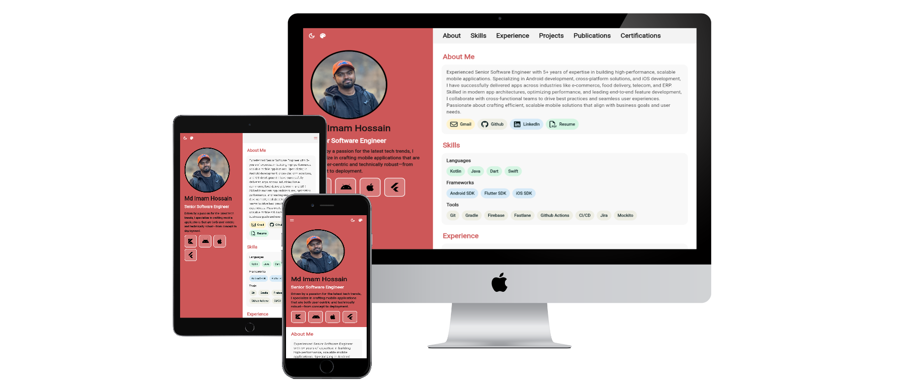

# Imam Hossain - Personal Portfolio Website

[](https://imam.dev)
[](https://flutter.dev)
[](https://dart.dev)

A personal website built with Flutter, featuring a responsive design optimized for web, tablet, and mobile platforms. The site delivers a clean UI and platform-specific UX for a seamless cross-device experience.

**🌐 Live Website:** [imam.dev](https://imam.dev)

## 📱 Project Screenshots

<div align="center">
  
  <p><em>Responsive personal portfolio showcasing professional experience and projects</em></p>
</div>

## ✨ Features

- **📱 Responsive Design**: Optimized for desktop, tablet, and mobile devices
- **🎨 Dynamic Theming**: Multiple color schemes with light/dark mode toggle
- **🌍 Internationalization**: Multi-language support using easy_localization
- **⚡ High Performance**: Optimized Flutter web build with WebAssembly (WASM)
- **🔧 Modular Architecture**: Clean architecture with dependency injection
- **📊 Real-time Updates**: Reactive state management using RxDart streams
- **🎯 Professional Sections**:
  - Personal Information & Bio
  - About Me
  - Skills & Technologies
  - Work Experience
  - Projects Portfolio
  - Publications
  - Certifications
- **🎪 Interactive Elements**: Smooth scrolling navigation and dynamic content
- **🚀 CI/CD Pipeline**: Automated deployment to GitHub Pages

## 🏗️ Technical Architecture

The project follows a clean, modular architecture pattern:

```
lib/
├── app/                    # Application initialization and core setup
│   ├── app_init/          # App initialization service and widgets
│   └── application.dart   # Main application widget
├── core/                  # Core utilities and shared components
│   ├── localization/      # Internationalization setup
│   ├── navigation/        # Navigation keys and routing
│   ├── theme/            # Theme configuration and service
│   └── utils/            # Utility functions and extensions
├── di/                   # Dependency injection setup
├── features/             # Feature-based modules
│   ├── about/           # About section
│   ├── certifications/  # Certifications display
│   ├── common/          # Shared widgets and models
│   ├── experience/      # Work experience
│   ├── personal_info/   # Personal information
│   ├── projects/        # Projects portfolio
│   ├── publications/    # Publications section
│   ├── skills/          # Skills and technologies
│   └── top_bar/         # Navigation bar
└── generated/           # Auto-generated localization files
```

### Design Patterns Used:
- **Service Pattern**: Business logic separated into services
- **Stream/BloC Pattern**: Reactive state management with RxDart
- **Dependency Injection**: Using GetIt for loose coupling
- **Repository Pattern**: Data layer abstraction
- **Responsive Design Pattern**: Platform-specific UI implementations

## 🛠️ Technologies Used

### Core Technologies
- **[Flutter](https://flutter.dev)** - Cross-platform UI framework
- **[Dart](https://dart.dev)** - Programming language

### Key Dependencies
- **[flex_color_scheme](https://pub.dev/packages/flex_color_scheme)** - Advanced theming and color schemes
- **[rxdart](https://pub.dev/packages/rxdart)** - Reactive programming extensions
- **[get_it](https://pub.dev/packages/get_it)** - Service locator for dependency injection
- **[easy_localization](https://pub.dev/packages/easy_localization)** - Internationalization and localization
- **[url_launcher](https://pub.dev/packages/url_launcher)** - External link handling
- **[font_awesome_flutter](https://pub.dev/packages/font_awesome_flutter)** - Icon library

### Development Tools
- **[build_runner](https://pub.dev/packages/build_runner)** - Code generation
- **[freezed](https://pub.dev/packages/freezed)** - Data class generation
- **[json_serializable](https://pub.dev/packages/json_serializable)** - JSON serialization
- **[flutter_lints](https://pub.dev/packages/flutter_lints)** - Dart linting rules

## 🚀 Getting Started

### Prerequisites
- Flutter SDK (>=3.5.3)
- Dart SDK (>=3.5.3)
- Web browser for testing
- Git

### Installation

1. **Clone the repository**
   ```bash
   git clone https://github.com/ihjohny/imam-hossain.git
   cd imam-hossain
   ```

2. **Install dependencies**
   ```bash
   flutter pub get
   ```

3. **Generate localization files**
   ```bash
   dart pub run easy_localization:generate -S assets/translations -f keys -o localization/locale_keys.g.dart
   dart pub run easy_localization:generate -S assets/translations -f json -o localization/locale_json.g.dart
   ```

4. **Generate model files (if needed)**
   ```bash
   dart run build_runner build
   ```

### Running the Project

#### Development Mode
```bash
# Run on web
flutter run -d web-server --web-port 8080

# Run on Chrome
flutter run -d chrome
```

#### Production Build
```bash
# Build for web with WebAssembly
flutter build web --wasm --release --no-tree-shake-icons

# Build for web (fallback without WASM)
flutter build web --release --no-tree-shake-icons
```

### Development Commands

<a id="generate-localization-files" style="text-decoration:none">**Generate localization files:**</a>

```bash
dart pub run easy_localization:generate -S assets/translations -f keys -o localization/locale_keys.g.dart
dart pub run easy_localization:generate -S assets/translations -f json -o localization/locale_json.g.dart
```

**Generate app icons:**
```bash
dart run flutter_launcher_icons
```

**Generate splash screens:**
```bash
dart run flutter_native_splash:create
```

## 🔄 GitHub Actions CI/CD

The project uses GitHub Actions for automated deployment to GitHub Pages. The workflow is defined in `.github/workflows/deploy.yaml`.

### Workflow Features:
- **Automated Deployment**: Triggers on push to `main` branch
- **Flutter Web Build**: Uses latest stable Flutter with WebAssembly support
- **GitHub Pages**: Automatically deploys to GitHub Pages
- **Custom Domain**: Supports custom domain configuration via `CNAME`

### Setup Instructions:

1. **Enable GitHub Pages**
   - Go to repository Settings → Pages
   - Select "Deploy from a branch"
   - Choose `gh-pages` branch

2. **Configure Custom Domain (Optional)**
   - In repository Settings → Pages → Custom domain
   - Enter your domain (e.g., `imam.dev`)
   - Or set `CNAME` variable in repository settings

3. **Workflow Configuration**
   - The workflow automatically detects if a custom domain is set
   - Base href is configured automatically based on domain setup
   - WebAssembly build is enabled for better performance

### Manual Deployment:
```bash
# Build the project
flutter build web --wasm --release --no-tree-shake-icons --base-href "/"

# Deploy to GitHub Pages (using gh-pages branch)
# This is handled automatically by GitHub Actions
```

## 📁 Project Structure

```
imam_hossain/
├── .github/workflows/      # GitHub Actions CI/CD
├── android/               # Android platform files
├── assets/               # Static assets
│   ├── fonts/           # Custom fonts
│   ├── images/          # Images and icons
│   └── translations/    # Localization files
├── build/               # Build outputs
├── docs/                # Documentation and screenshots
├── ios/                 # iOS platform files
├── lib/                 # Main source code
├── linux/               # Linux platform files
├── macos/               # macOS platform files
├── test/                # Unit tests
├── web/                 # Web platform files
├── windows/             # Windows platform files
├── pubspec.yaml         # Project dependencies
└── README.md           # This file
```

## 🤝 Contributing

1. Fork the repository
2. Create a feature branch (`git checkout -b feature/amazing-feature`)
3. Commit your changes (`git commit -m 'Add some amazing feature'`)
4. Push to the branch (`git push origin feature/amazing-feature`)
5. Open a Pull Request

## 📄 License

This project is open source and available under the [MIT License](LICENSE).

## 👨‍💻 Author

**Md Imam Hossain**
- Website: [imam.dev](https://imam.dev)
- GitHub: [@ihjohny](https://github.com/ihjohny)

---

<div align="center">
  <p>Crafted with ❤️ using Flutter</p>
  <p>© 2025 Imam</p>
</div>
